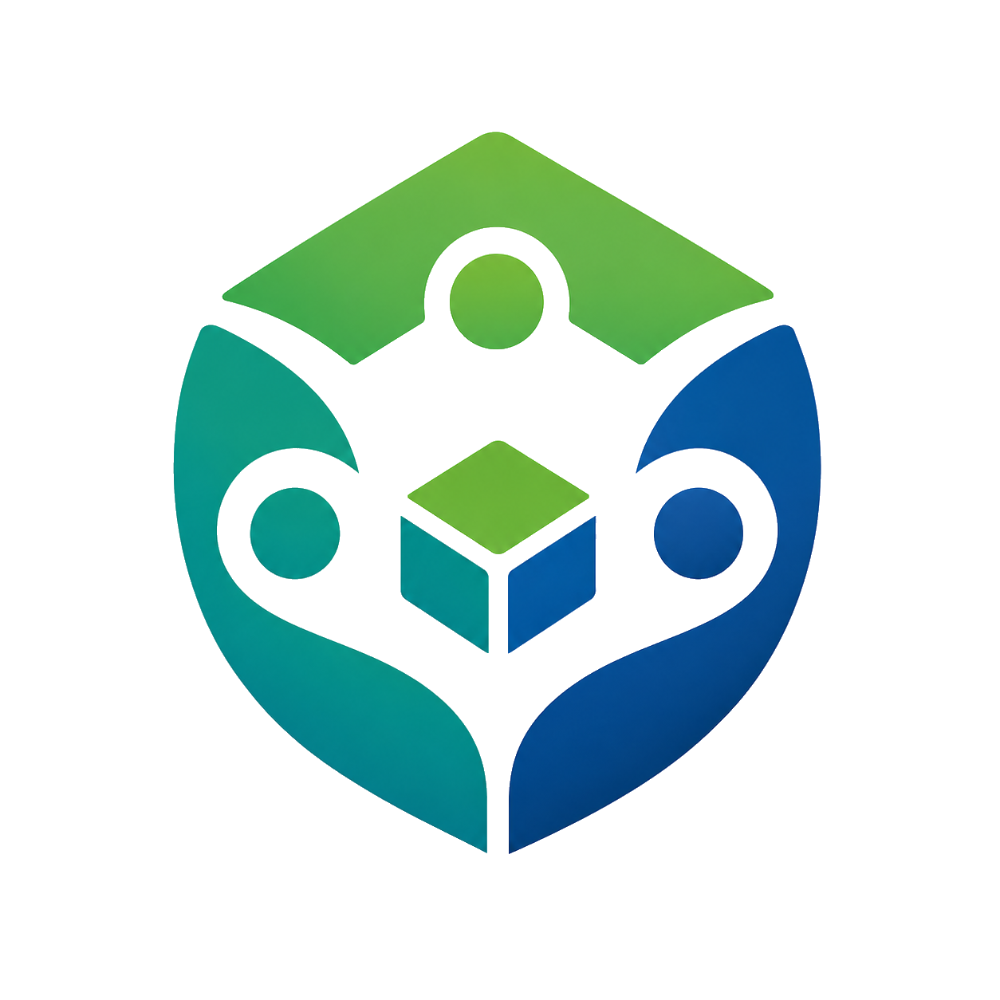

Vorliq
======

Live app: https://vorliq.org

Public docs: https://vorliq.github.io/Vorliq

Testing guide: https://vorliq.github.io/Vorliq/testing.html

What is Vorliq
--------------

Vorliq is experimental open-source community blockchain software built on its own lightweight blockchain. It does not depend on Ethereum, Bitcoin, Solana, or any outside cryptocurrency network. The native coin is called VLQ, and the application includes a Python proof of work blockchain core, a Node.js backend API, a React web application, and a React Native mobile application.

Vorliq is community coordination and record-keeping software for its own VLQ blockchain. It is not a licensed bank, broker, exchange, lender, investment adviser, custodian, or financial institution. Members can create wallets, mine blocks, send signed VLQ transactions, request community support, vote on requests with VLQ balance as voting weight, post buy and sell offers, connect peer nodes, monitor network health, and vote on governance proposals that can change supported network rules.

What is VLQ
-----------

VLQ is the native coin of the Vorliq network. The maximum supply is 21 million VLQ. The starting mining reward is 50 VLQ per block, and the scheduled reward halves every 210000 blocks. Mining rewards are created by the Vorliq blockchain itself and normal transactions are signed with SECP256K1 cryptographic keys. VLQ has no guaranteed market value, is not listed on public exchanges by the project, and should not be treated as an investment promise.

Vorliq also includes community governance, so VLQ holders can vote on proposals that change network parameters. That means the community can vote to change the mining reward, block difficulty, loan rules, exchange limits, and other supported settings instead of relying on a central operator.

Features
--------

Vorliq includes a complete proof of work blockchain written in Python. Blocks contain signed transactions, link to the previous block by hash, and are mined with a proof of work target. Wallets use real SECP256K1 keys and addresses derived from public key hashing.

The community lending-style system lets members request VLQ support and lets other members vote to approve or reject those requests using VLQ balance as voting weight. Approved requests are issued through the blockchain and repayments are tracked by the lending system. This feature is experimental software and is not a licensed lending service.

The decentralized VLQ exchange lets community members post buy and sell offers directly inside Vorliq. Offers can describe any community-agreed price, such as money, goods, services, or time, so local communities can coordinate in the way that makes sense to them. This is an experimental offer board, not a licensed exchange, broker, dealer, or escrow service.

The peer to peer network lets Vorliq nodes register peers, broadcast transactions and blocks, discover other peers, and synchronize to the longest valid chain. The network has been tested with multi node stress tests covering synchronization, network partition recovery, and double spend prevention.

The community governance system gives VLQ holders on-chain voting power over Vorliq rules. Members can propose changes, vote with balance-weighted votes, and approved proposals automatically apply supported changes such as mining reward and difficulty updates.

The React web application provides the browser interface for wallets, sending VLQ, mining, chain exploration, lending, exchange, governance, treasury, faucet, profiles, node registry, statistics, account history, notifications, and health monitoring. The React Native Expo mobile application supports community-testing flows for wallet creation, local signing, sending, faucet claims, mining status, transaction and block details, profiles, lending repayment, exchange trade actions, governance views, treasury proposal submission and voting, node registry status, settings, and notifications.

Vorliq includes encrypted browser wallet storage, local key storage on mobile, dark and light mode, persistent notifications, push notification support through Expo, node diagnostics, rotating logs, atomic JSON persistence with backup-before-write protection, storage health reporting, a public node registry, GitHub Pages documentation, a full test suite, GitHub Actions CI, and production deployment documentation.

Transparency and Safety
-----------------------

Vorliq is live software, but it is still an early cryptocurrency-style network. Mining rewards, treasury rewards, tips, exchange offers, lending activity, price signals, and governance votes are experimental software features and may change over time. The public transparency page explains what is live today, what is experimental, what operational protections exist, and what limitations remain: https://vorliq.github.io/Vorliq/transparency.html.

Vorliq is self-custody. The server stores public blockchain data, forum posts, governance activity, exchange offers, lending records, and operational state, but it does not store user private keys or wallet passwords. Lost private keys cannot be recovered by Vorliq, so users should read the wallet safety guide before using real wallets: https://vorliq.github.io/Vorliq/wallet-safety.html.

Public network proof is available through the status page, the recovery guide, the storage reliability guide, public audit exports, and the machine-readable network manifest. Users and developers can check https://status.vorliq.org, https://vorliq.github.io/Vorliq/recovery.html, https://vorliq.github.io/Vorliq/storage.html, https://vorliq.github.io/Vorliq/audit.html, https://vorliq.org/api/audit/manifest, and https://vorliq.org/api/network/manifest. The build and deployment process is public through GitHub Actions at https://github.com/vorliq/Vorliq/actions.

How to Run
----------

To run Vorliq on Windows, install Git, Node.js LTS, and Python 3.12 first. When installing Python, make sure the Add to PATH checkbox is selected. After those tools are installed, open a terminal in the folder where you want Vorliq to live and run `git clone https://github.com/vorliq/Vorliq.git`. Then open the downloaded Vorliq folder.

The easiest way to start the application is to double click `start.bat` in the root folder. The script starts the Python blockchain API, the Node.js backend API, the React web app, and the heartbeat service in separate terminal windows. After the windows open, visit `http://localhost:3000` in your browser.

If you are setting up from a fresh clone, install the dependencies first. In the `blockchain` folder create and activate the Python virtual environment with `python -m venv .venv` and `.venv\Scripts\activate`, then run `pip install -r requirements.txt`. In the `backend` folder run `npm install`. In the `frontend` folder run `npm install`. In the `mobile` folder run `npm install` if you want to run the Expo mobile application.

To use the mobile app, install Expo Go on your phone, open a terminal in the `mobile` folder, run `npx expo start`, and scan the QR code with Expo Go. The default mobile node URL is `https://vorliq.org`. In the mobile Settings screen, you can switch to your own backend, usually something like `http://192.168.1.20:5000` on your local network. Private mobile service files such as Android notification config should stay out of git.

Testing
-------

Vorliq uses Python tests for blockchain behavior, backend Jest tests for API behavior, frontend React tests for browser UI state, SDK build/smoke checks, mobile Expo export when mobile code changes, and Playwright Chromium E2E tests for read-only production route, layout, navigation, and API smoke coverage. The Playwright suite is intentionally non-destructive: it does not claim faucet funds, mine production blocks, create posts, submit offers, create proposals, spend treasury funds, or use admin tokens. See the full guide at https://vorliq.github.io/Vorliq/testing.html.

Community
---------

Discord: https://discord.gg/qpX5sHD4pC

Telegram: https://t.me/Vorliq

Reddit: https://www.reddit.com/u/Vorliq/s/PbPMGkrGVS

GitHub: https://github.com/vorliq/Vorliq

X: https://x.com/vorliq
